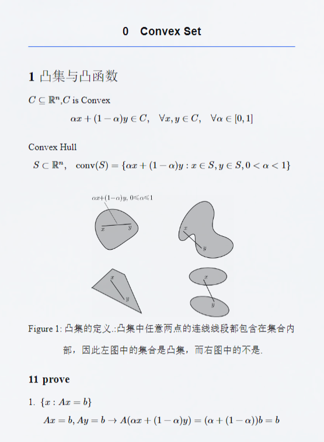

# 自学生成模型入门笔记

我在学习生成模型过程中所做的笔记，记录了自己对各种模型的理解和实践，包括实现代码和一些重要的理论。所有内容均使用Typst排版整理，便于后续查阅和复习，还有我去面试北大实习生的ppt也是使用typst写的。

## 包括的笔记有:

- [x] **autoencoder**

- [x] **pca** (有对应的代码)

- [x] vae

 - [ ] <del> gan (已学完,待补充)</del>

- [x] cgan (有对应的代码)

- [ ] <del> Convex Optimization(完全没学,完全没写,待补充)</del>

- [ ] <del> Probability plot(起了个头,待补充)</del>

- [ ] <del>diffusion (已学完,待补充)</del>

- [x] pku实习生面试ppt

## 部分笔记截图如下:

 

    <table>
        <tr>
            <td></td>
            <td></td>
            <td></td>
            <td></td>
        </tr>
        <tr>
            <td></td>
            <td></td>
            <td></td>
            <td></td>
        </tr>
        <tr>
            <td colspan="2"></td>
            <td colspan="2"></td>
        </tr>
    </table>

